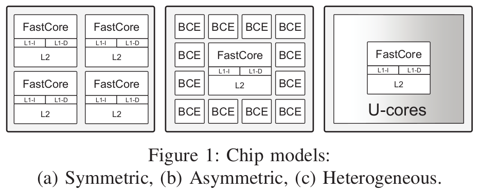
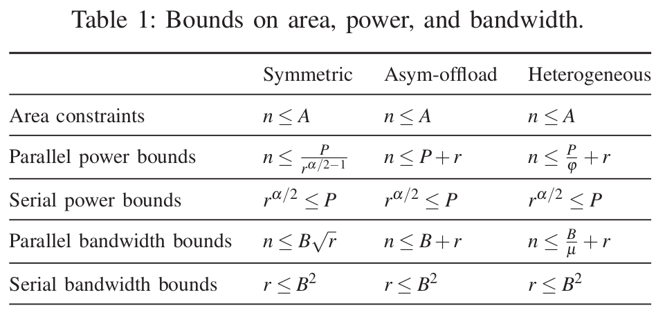

# Single-Chip Heterogeneous Computing: Does the Future Include Custom Logic, FPGAs, and GPGPUs? - Eric S. Chung, Peter A. Milder, James C. Hoe, and Ken Mai.

## Resumen

* Se presenta un nuevo paradigma, el *single-chip heterogeneous computing*, el cual permite llegar a mejor eficiencia energética combinando los procesadores tradicionales con los U-cores. Todo esto apuntando a los intereses de la ITRS en ese momento (2010). Utiliza las fortalezas de la diversidad, por ejemplo sacarle el provecho a la CPU, GPU y la FPGA según su potencial.
* Dentro de las soluciones propuestas de los U-cores se encuentran las GPGPUs con aceleración usando SIMD engines.
* Para poder explotar efectivamente el concepto de las U-cores se recomienda un paralelismo sobre el 90%.
## Background

* Extiende el trabajo del multiprocesador de Hill y Marty.

* Ley de Amdhal:
	* $$Speedup = \dfrac{1}{\left(\dfrac{f}{S}+1-f\right)}$$
	* $$Speedup_{symmetric} = \dfrac{1}{\left( \dfrac{1-f}{perf_{seq}(r)}+\dfrac{f}{(n/r)\times perf_{seq}(r)} \right)}$$
	* $$Speedup_{asymmetric} = \dfrac{1}{\left( \dfrac{1-f}{perf_{seq}(r)}+\dfrac{f}{perf_{seq}(r) +n-r} \right)}$$
	* $$perf_{seq} (r) = \sqrt{r}$$
* 3 acercamientos no-von-Neumann para la computación:
	1. Custom logic o ASICs. Alcanzan la mejor relación de eficiencia energética pero no pueden ser re modificadas y son muy costosas.
	2. GPGPUs. Principalmente usan la vectorización de SIMD y a través de multithreading se esconden las grandes latencias. (paralelismo)
	3. FPGAs. Tienen la flexibilidad de su lado con las LUTs (Lookup tables).
### Modelado
Se realizan múltiples supuestos. El primero es que se omite la interconección de los U-cores y cómo se conectan, por simplicidad. LO segundo es que los BCE consumen una potencia de 1 cuando están funcionando completamente, lo que incluye las fugas y la potencia dinámica. Lo último, se asume que los cores que no están operando pueden ser apagados completamente sin el overhead de la potencia estática.

* El parámetro P hace referencia a la potencia activa del BCE core.
* El parámetro A hace referencia al area budget, el cual nos acota el área en los chip models.
* El parámetro B define el máximo bandwidth que se puede lograr off-chip.
* El parámetro $\mu$ representa el rendimiento relativo al BCE core.
* El parámetro $\phi$ representa el consumo de potencia activa de los u-cores.

$$Speedup_{heterogeneous} = \dfrac{1}{\left( \dfrac{1-f}{perf_{seq}(r)}+\dfrac{f}{\mu(n-r)} \right)}$$

***Notar que para valores de $\mathbf{\phi}$ pequeños se disminuye el impacto de la potencia P, mientras que para $\mathbf{\mu}$ más grandes se tiene un mayor consumo de ancho de banda.***

### Metodología
Para estimar los parámetros adecuados para el modelo de chip heterogeneo los autores proceden a estudiar los dispositivos de la época, revisar los tamaños de los cores para las CPUs, GPUs y FPGAs. Luego se les aplican algoritmos de diferentes enfoques (computing intensive o memory intensive).

* Matrix-Matrix Multiplication. Intenso en computación aritmética, pero tiene requerimientos bajos en memoria.
* Fast Fourier Transform. Posee complejos pasos de datos y tiene requerimientos de memoria.
* Black-Scholes. Posee diferentes operadores en su ecuación.
### Conceptos Claves
1. [CPU](https://en.wikipedia.org/wiki/Central_processing_unit): Central Processing Unit.
2. [GPU](https://en.wikipedia.org/wiki/Graphics_processing_unit): Graphics Processing Unit.
3. [GPGPU](https://es.wikipedia.org/wiki/GPGPU): General-purpose GPUs. CUDA es un tipo de GPGPU
4. [FPGA](https://es.wikipedia.org/wiki/Field-programmable_gate_array): Field-Programmable Gate Array.
5. U-cores: Unconventional cores. Pueden ser FPGAs o GPGPUs.
6. [ASIC](https://en.wikipedia.org/wiki/Application-specific_integrated_circuit): Application-Specific Integrated Circuit 
7. [ITRS](http://www.itrs2.net/itrs-news.html): International Technology Roadmap for Semiconductors.
8. [SIMD](https://es.wikipedia.org/wiki/SIMD): Single Instruction Multiple Data
9. Fast cores: Usado para procesar las instrucciones secuenciales.
10. Base-Cores-Equivalents (BCE): Usados para ejecutar paralelamente partes de un código.
11. [MMM](https://en.wikipedia.org/wiki/Matrix_multiplication): Matrix-Matrix Multiplication.
12. [FFT](https://es.wikipedia.org/wiki/Transformada_r%C3%A1pida_de_Fourier): Fast Fourier Transform.
13. [BS](https://es.wikipedia.org/wiki/Modelo_de_Black-Scholes): Black Scholes.

### BASELINE PERFORMANCE AND POWER
#### Preguntas

1. ¿A qué se refiere con un paralelismo del X%?

#### Referencias

1. M. D. Hill et al., “Amdahl’s Law in the Multicore Era,” Computer, vol. 41, pp. 33–38, 2008
